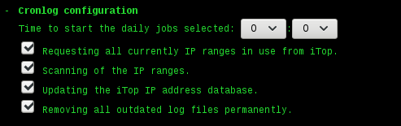
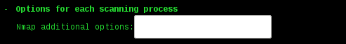

------

**S c a n 2  -  S u i t e** 

*Scan2 unifies the process of providing [iTop](https://de.wikipedia.org/wiki/ITop) with [TeemIP](https://wiki.teemip.net/doku.php) with up to date data.*

------

History of this document:
| version | author | date       | topic       |
| :------ | :----- | :--------- | :---------- |
| 0.9     | EJS    | 2019-03-08 | first draft |
------
**Table of Contents**

[TOC]
------

# Purpose

Scan2 is designed to work together with iTop developed by [Combodo](https://www.combodo.com/?lang=en). The software is 100% open source with the option to buy additional services. The software provides a web interface for all the related task. Internally it's using [SQL](https://en.wikipedia.org/wiki/SQL) (Structured Query Language) for storing the informations and a very tricky structure, added on top of it. This way mapping the "real world" to the abstract world of data is possible. To make iTop even more use full, it's supports [ITIL](https://en.wikipedia.org/wiki/ITIL) (IT Infrastructure Library) out of the box. iTop is related a [ITSM](https://en.wikipedia.org/wiki/IT_service_management) (IT Service Management) system. The system supports the user to get all aspects of management processes organized. However every system is as good as the data your working with. Without any automatic systems to get live data into the system, working with an ITSM system is extremely boring and expensive, because someone has to input the data manually. Luckily iTop provides a very flexible way to of getting data into the system and keeping track of it. In terms of iTop they call the software "data collector". The software is written in [PHP](https://en.wikipedia.org/wiki/PHP) (PHP: Hypertest Preprocessor) like the the rest of the iTop system. PHP provides the possibility to use it as an add on for many web servers, or on the [CLI](https://en.wikipedia.org/wiki/Command-line_interface) (Command Line Interface). The software works reliable and by supporting a kind of debug mode quite transparent, but the documentation to the "data collector" software is quit thin, the configuration is done by directly editing the [XML](https://en.wikipedia.org/wiki/XML) file (Extensible Markup Language) and providing scripts automated processes has to be done by the user. Scan2 fills the gab offering a curses based configuration dialog for the putting into operation process and separate web servers for each service modules. The UI shows the URL for each service.

 

- Scan2IP - Port 5000
  
- Scan2Agent - Port 5001
  
- Scan2VMware - Port 5002
  

To give everybody the opportunity to adapt the software to it's specific needs, Scan2 is Open Source.

------

# Requirements

The listed requirements are mandatory for the moment. They represent the current test environment. Different versions of the software will be supported in the future.

- iTop Version <= 2.5 for [Linux](https://en.wikipedia.org/wiki/Linux)
- [vSphere](https://en.wikipedia.org/wiki/VMware_vSphere) Version >= 6.0
- [OCS Inventory](https://en.wikipedia.org/wiki/OCS_Inventory) Agents Version > 2.0
- Scan2 Virtual Appliance 0.9 for [VMware](https://en.wikipedia.org/wiki/VMware) (Out of the box.) or [VirtualBox](https://en.wikipedia.org/wiki/VirtualBox) (Network configuration has to be changed.).

------

# Features

The current Scan2 version supports the user with the listed features.

- Scan2IP - IPv4 scanning
  The current version of Scan2IP supports the user by keeping track of used IPv4 addresses. To assign the right "Organisation ID" the system accesses these information on the iTop server. The system downloads all assign IPv4 Subnet Blocks and scans this ranges for IPv4 addresses in use. Out of the box, the systems send out only normal ping packets to look for hosts. All additional possibilities of the underlaying scan systems are deactivated. No port scan for service detection will take place. The web interface allows the user to configure all parameters including the time for the daily scan job and the number of log files the system will keep before cleaning up.
- Scan2VMware - retrieving vSphere data
  The originally distributed version of the VMware collector has build in support for multiple vSphere servers, however the creation and adapting the XML configuration files has to be done by the user. The next inconvenience is that all farms, servers and virtual machines are assigned to a single "Organization ID" only. Similar to the Scan2IP system this system downloads the information of all assigned IPv4 Subnet Blocks as well as all the data retrieved by the Scan2IP system. Based on this information the systems assigns the related "Organization ID" to every data. Another feature of the system is the support for multiple vSphere servers.
- Scan2Agent - currently it extracts informations of installed software packets only
  This system uses the OCS agent data directly, bypassing any OCS server. The system provides a endpoint for the OCS agents. The current version supports Windows and Linux systems only. Support for Android, OS-X and other systems will be added in the future. Support for physical machines, not only virtual ones, are currently being tested and added in futures releases of the software.   

------

# Configuration

- Scan2IP

  The configuration of the Scan2IP service is very simple. Only the *iTop access* parameters has to be changed to get this service working.

  
  
  
  
  
  
  

  Creating a user account on the iTop system is done by selecting *Admin tools* followed by selecting *User Accounts* on the iTop web interface. Pressing the button field *New…* shows the next option:

  

  Selecting *iTop user* and pressing *Apply* shows the next input screen:

  

  On the *Properties* side only the fields *Login* and *Password* requires our attention. This parameters must match the settings at the Scan2IP configuration page. Before pressing the button *Create* to establish this user account, it is mandatory to assign a profile to this user account and the tab *Profiles* gives us the opportunity for it. The next screen shot shows the *Profiles* dialog without any added profiles. 

  

  Pressing the *Add Profiles…* button shows the dialog to add profiles to the user account. In this case the *Administrator* profile is already selected. Using the administrator profile for this task is the easiest but least secure choice. It’s done to get any possible iTop problems out of the way.  For the final touch of the system, the administrator profile should be replaced by a restricted profile only suitable for this task.

  

  This screen shot shows the *Profiles* dialog with the added Administrator profile. Pressing *Create* will create the user account and allows the Scan2IP service to access the iTop server.

  

  A quick test of the system is possible by pressing the *IP Range Update* button on the *Tools* tab of the Scan2IP web UI.

  
  
  
  
  
  

  As result the list of IP ranges shown on the iTop web UI, should show up on the *Job* tab of the Scan2IP web UI.

  

  Scan2IP *job* tab:

  

- Scan2Agent
  Similar to the Scan2IP only the iTop parameters has to be changed. Using the same user name is possible. It is not necessary to create another user for this service. The most important thing is to change the IP address of the OCS server on each client system. The Scan2 system must be addressed as new OCS server. Testing of the configuration is currently only possible by login onto the client and telling the client agent directly to transmit the current status of the database.

  
  
  
  
  
  
  

- Scan2VMware
  The configuration of the iTop access offers nothing new and reusing the user account from Scan2IP and Scan2Agent is possible. The part *vSphere access* give the possibility to enter the *URL*, *USER NAME* and *PASSWORD* for one or more vSphere servers.

  
  
  
  
  
  
  
  

  Pressing the *Access Server* button on *Tools* tab of the Scan2VMware web page starts the communication process with the selected vCenter. This will take a few minutes.

  

  The result of this and all other communication task will show up on the *Log Files* tab of the web page:

  

------

# Dataflow

To keep the *Scan2* system as flexible as possible, no service will contact the other service directly. The only source of information for each service are either there distinct agents on the client systems, software used by this service alone or iTop itself. There is **no** inter service communication. 

------

# How-to

- [VirtualBox](https://en.wikipedia.org/wiki/VirtualBox)
  Using the Scan2 [OVF](https://en.wikipedia.org/wiki/Open_Virtualization_Format) file without any changes will result in the next boot screen:
  
  

  This is caused by different network device names between VMware and VirtualBox. The first step is to change the virtual network device on the host side:
  
  

  The next part is to change the network configuration of the guest system. By pressing the *F2* button the editor will show up with the contents of the */etc/network/interfaces* file. This file has to be changed according to next screen shot:
  
  

- Scan2 CLI
  Pressing the *F3* button calls the CLI interface. Next a short list of some useful commands:

  - **ip address**
    Shows the current network configuration.
  - **aptitude**
    Installing new software.
  - **mc**
    Browsing the local file system.
  - **crontab -e**
    Examining the currently active time planer.
  - **lynx**
    Web browser to access the web based service configuration UI.
  - **top**
    Show the current system status. CPU, MEMORY, TASKS …
  - **sysv-rc-conf**
    Configuration to the system services.mc
  - **mysql**
    Access to the local database.

------

# Future

- Extending the Scan2Agent to recognize physical devices.
- Support for MAC OS-X and Android devices. 